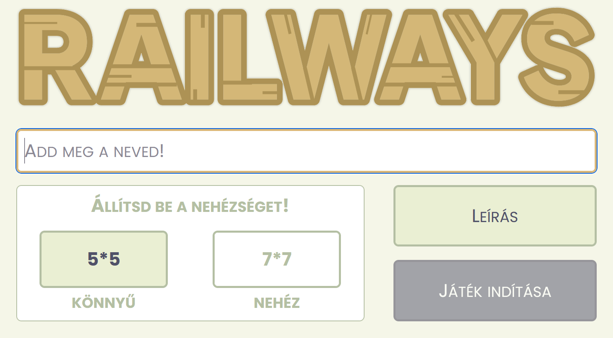
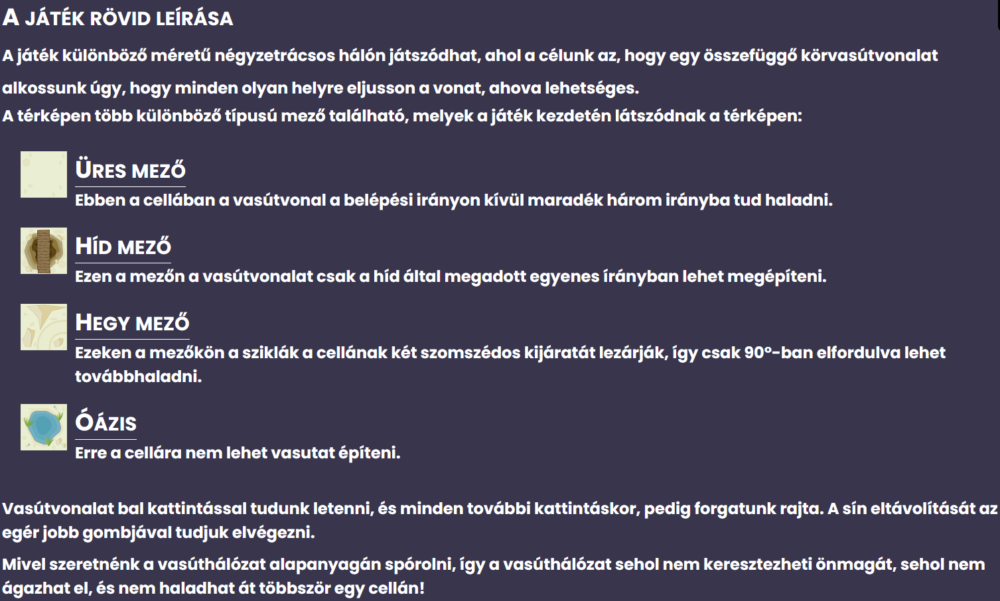
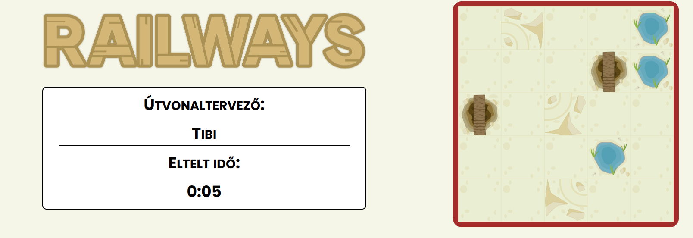
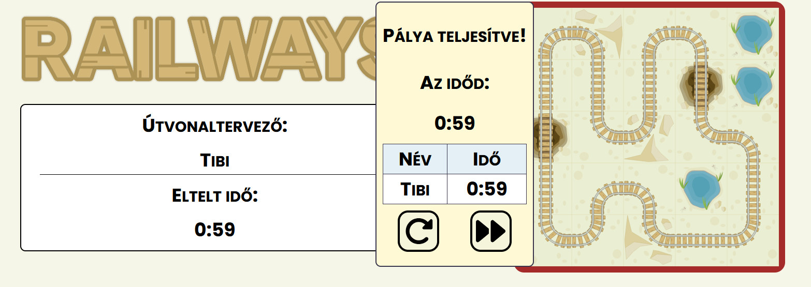

# Railways

I completed this project for my Web Programming course in my third semester. The course aimed to introduce us to using JavaScript to create interactive websites.

The objective of the game is to build a railway network connecting all the tiles on the board. There are multiple levels, each with their own local leaderboard.
Maps can be either 5x5 (easy mode) or 7x7 (hard mode).

## Menu

## Rules

## Game

## Won state

