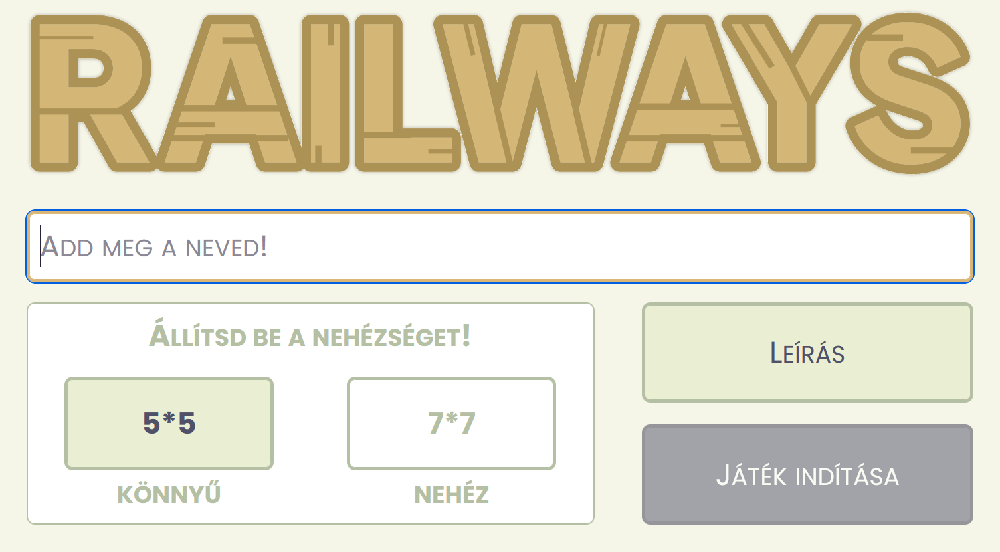
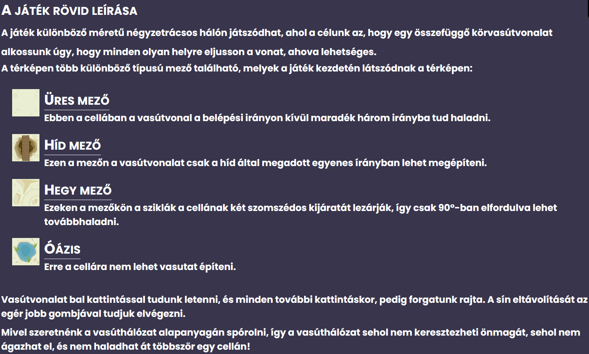
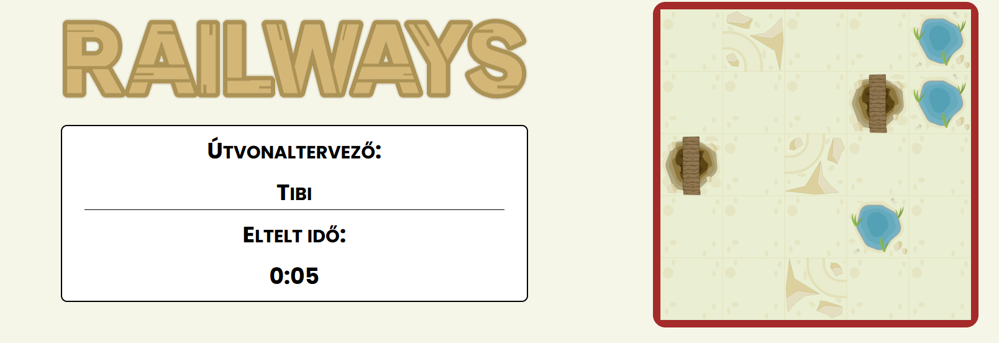
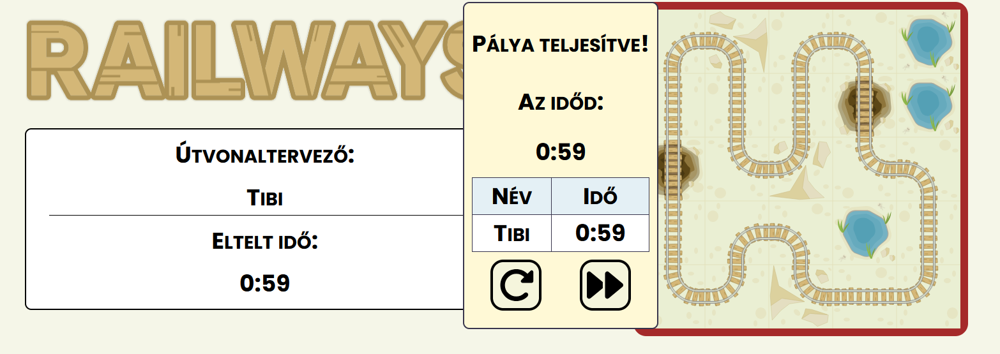

# Railways

I completed this project for my Web Programming course in my third semester. The course aimed to introduce us to using JavaScript to create interactive websites.

The goal of the game is to build a circular railway that connects each tile of the board. There are obstacles on the board which will not let you place any railroad on them.
The game has multiple levels, which can be the size of 5x5 (easy) or 7x7 (hard)
Each level has their own leaderboard that keeps track of how much time it took to complete the level.

## Menu

## Rules

## Game

## Won state

